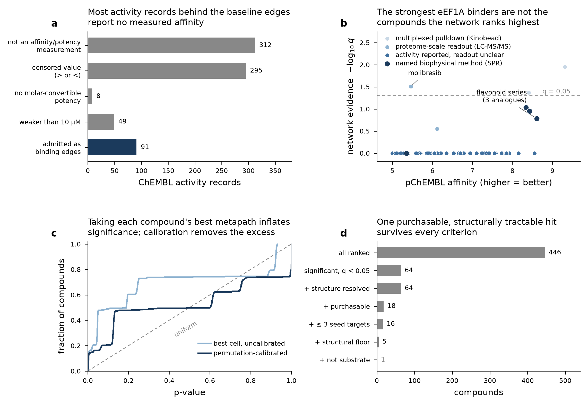
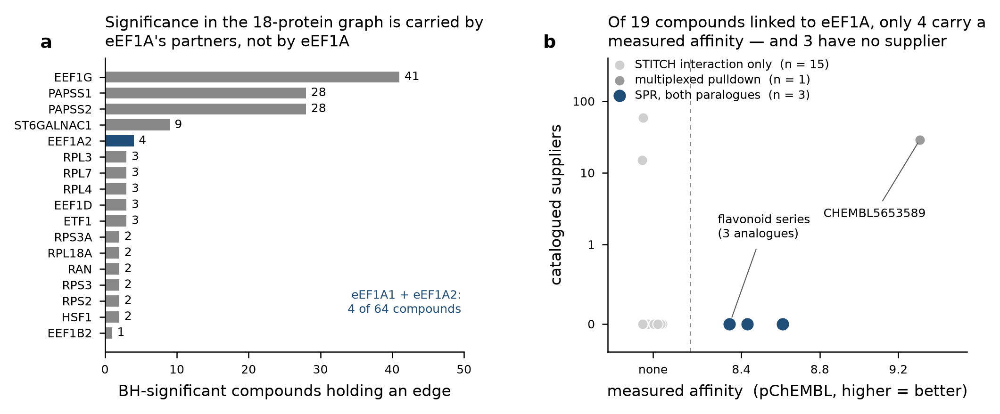

# Corrected iteration: what changed and why



*(a) Edge admission: most ChEMBL activity records behind the baseline binding
edges report no measured affinity. (b) Network rank and measured affinity point
at different compounds; marker shade is assay provenance. (c) The uncalibrated
min-over-metapaths statistic is anticonservative; permutation calibration
removes the excess. (d) Candidate funnel, applied in pipeline order.*

This branch reworks the hetnet pipeline in `main`. Every change below is either a
defect fix or a new evidence layer; nothing in `main` is deleted without a stated
reason, and no claim in the output rests on a filter that is not written down here.

Scopes are unchanged: `full-interactome` (18 seed proteins) and `eef1a-only`
(EEF1A1 + EEF1A2, kept as separate gene nodes throughout). HIV-1 appears nowhere
as a target, disease or node - the graph is human host biology only.

---

## 1. DWPC was wrong on metapaths that revisit a gene node

`main` computed degree-weighted path counts by chained sparse matrix products.
That counts walks, not paths: on `CbGiG` a walk may leave a gene and return to
it, and those self-returning walks were being credited as evidence.

**Fix.** `src/dwpc.py` subtracts the repeated-node contribution exactly, rather
than approximating it. `tests/test_dwpc_repeat.py::test_repeat_correction_matches_path_enumeration`
pins the corrected value against brute-force path enumeration, and
`test_walk_count_is_an_upper_bound_and_is_not_equal` fails on the old
implementation. `test_unsupported_repeat_pattern_raises_rather_than_approximating`
pins that an unhandled repeat pattern is an error, not a silent approximation.

Effect: DWPCs on the two-hop gene metapaths drop; the ranking reorders.

## 2. The binding layer admitted records with no measured affinity

The committed `compound_binds_gene` table in `main` includes rows whose
`standard_relation` is `>` or `<` (a non-detect: the assay established only that
the true value lies beyond the tested range) and rows whose `standard_type` is
not an affinity or potency measurement at all (percent inhibition, fold change,
"activity" with no units). A non-detect is evidence *against* binding, and it was
being scored as an edge.

**Fix.** `src/activity_filter.py` admits a record only if it reports an exact
relation (`=`), an affinity/potency measurement type, a molar-convertible value,
a potency at or above 10 µM, and no ChEMBL validity flag. Every rejection is
attributed to exactly one criterion in an audit table
(`tests/test_activity_filter.py::test_audit_accounts_for_every_input_record`). Surviving records collapse to one edge per compound-protein pair,
keeping the strongest affinity and recording how many records backed it.

Effect on `full-interactome`: 755 activity records -> 91 admitted binding edges
(312 not an affinity measurement, 295 censored, 49 weaker than 10 µM, 8 with no
molar-convertible value). Panel **a** of `fig_corrections.png`.

**One consequence is worth flagging.** Cycloheximide leaves the graph. Its only
ChEMBL records against any seed protein are a percent-inhibition entry with no
numeric value and an "activity" entry with no value or units - both of which
`main` admitted as binding edges. Its documented site is on the ribosome, not on
eEF1A, so this is the filter working, not a loss.
`tests/test_compute_all_dwpcs.py::test_only_numerically_measured_affinities_become_direct_binder_edges`
asserts its absence.

## 3. One p-value per compound was taken from the compound's best metapath

`main` reported, per compound, the smallest p-value over metapaths. The
annotation metapaths share a prefix, so their cells are strongly correlated and
that minimum is not a p-value - it is anticonservative by construction, and the
inflation is not something a Bonferroni factor of "number of metapaths" removes.

**Fix.** `src/compute_null_distribution.py` draws 10,000 XSwap-permuted graphs
per scope, preserving node degree, and `src/compute_pvalues.py` calibrates the
min-over-cells statistic against the same minimum computed on permuted data.
Three corrections are reported side by side - Benjamini-Hochberg,
Bonferroni, and Westfall-Young (which exploits the observed correlation and is
never more conservative than Bonferroni). The pooled gamma-hurdle fit retained
from `main` survives only as a cell-level comparison column and drives no hit
call.

`tests/test_pvalues.py::test_calibrated_min_p_is_calibrated_under_the_null` pins
that the calibrated statistic is near-uniform on held-out permutations, and
`test_uncalibrated_minimum_is_anticonservative` pins the inflation it removes on
the same draws. Panel **c**.

Smallest reportable p-value is 1/10,001; the permutation count travels in the
output so no p-value can be quoted below its own resolution.

## 4. New: a STITCH compound-gene layer

`main` had one chemical edge layer (ChEMBL binding). This branch adds a second,
`CsG`, from STITCH experimental and database channels at confidence >= 400, with
text-mining channels discarded (a co-mention is not an interaction). Seed
proteins are resolved to STRING identifiers through UniProt cross-references.

The two layers are **never merged into one metaedge**: `CbG` and `CsG` generate
separate metapaths, so a reader can always see which layer carried a compound.
`tests/test_compute_all_dwpcs.py::test_stitch_metapaths_are_present_and_separate_from_binding`
asserts they stay distinct.

Effect: the compound population grows from 91 binding-edge compounds to 446
ranked compounds, most arriving through STITCH only.

## 5. New: a structural floor, because STITCH ranks ions

With STITCH in, the top of the ranking filled with species that score well on
connectivity and are not candidate inhibitors: chloride, magnesium, glycerol,
GDP, phosphoamino acids. The existing substrate-relation flag could not catch
them - it marks compounds whose evidence rests only on *substrate-binding seed
proteins*, and extending it would have flagged genuine eEF1A binders too.

**Fix.** `src/chem_tractability.py` applies a compound-side floor computed from
structure: organic, ring-bearing, no metal or metalloid, 250-700 Da, >= 18 heavy
atoms. A separate flag marks nucleotide cofactors, which is needed because eEF1A
is a GTP-binding protein and GDP clears any size-based floor on its own.

Both are **advisory columns with a human-readable exclusion reason**, not
deletions: every compound stays in the ranked table and says why it is or is not
a candidate. The floor is a candidate filter, not a druglikeness test - caffeine
fails it at 194 Da, correctly.

## 6. New: assay provenance grading

Two of the most potent, best-stocked compounds in the corrected ranking carry
measured affinities against 8-13 seed proteins each. Checking their assays: every
record has ChEMBL `confidence_score` 9, `assay_type` B and an exact relation, so
no conventional quality field flags them - but the descriptions identify
Kinobead pulldowns and Coomassie/LC-MS/MS fold-change readouts, several from a
single source document. These are multiplexed chemoproteomics deposits: one
experiment, one record per captured protein. Real measurements, but not the
targeted binding assay a reader would assume from a *K*d column.

**Fix.** `src/s07_assay_provenance.py` grades each edge:

| grade | meaning |
|---|---|
| `direct_biophysical` | description names a biophysical binding method (SPR, ITC, calorimetry, ...) |
| `assay_reported` | an activity is reported; the readout cannot be established from structured fields |
| `proteome_readout` | the measured quantity is abundance or enrichment across many proteins |
| `multiplexed_pulldown` | one document reports >= 4 distinct seed proteins for this compound (`MULTIPLEX_MIN_PROTEINS`) |

Document breadth is always measured on the full-interactome activities, never on the
scope being graded, so a two-gene scope cannot launder a thirteen-protein Kinobead
deposit into a targeted measurement. The primary rule is mechanical (document breadth); the keyword scan is
corroboration, so a label does not hinge on curator phrasing. The generic phrase
"pull down" is deliberately **not** a demotion keyword - biotinylated-probe
pulldowns read out by western blot against one named protein are targeted
evidence, and three of the strongest eEF1A binders here are measured that way.

**A limit worth stating plainly:** ChEMBL's structured fields cannot separate
binding from cell-based functional evidence on this dataset. The HSF1 HSP72
reporter ELISAs are typed `B`, and the eEF1A SPR assays carry a `cell_chembl_id`
(the protein source), so neither `assay_type` nor the cell-line field
discriminates. Rather than infer it, `assay_reported` means only what it says,
and the full assay description travels with every output row.

---

## What the corrected pipeline actually returns

The funnel (panel **d**, `full-interactome`): 446 ranked -> 64 significant at
q < 0.05 -> 64 with a resolved structure -> 18 purchasable -> 16 binding <= 3 seed
proteins -> 5 clearing the structural floor -> **1** that is not a substrate or
cofactor relation.

That one compound is **molibresib** (CHEMBL1232461, 73 catalogued suppliers) -
and its seed-protein evidence is a `multiplexed_pulldown`: a single document
reports it against six seed proteins by LC-MS/MS fold change.

Meanwhile the three strongest measured eEF1A binders on the graph - a flavonoid
series, pChEMBL 8.3-8.6 by SPR against **both** paralogues, from Yao et al.,
*J Med Chem* 2011, 54:4339 (doi:10.1021/jm101440r), an OBOC screen - have **no
catalogued supplier at all**.

`results/lead_candidates.*.csv` therefore contains both groups, with
purchasability as a visible column rather than a gate: dropping the flavonoids
for want of a catalogue entry would hide the best binding evidence the graph has.
Panel **b** plots this directly - network rank and measured affinity point at
different compounds.

Two things follow for bench work, and neither is something the network can
settle: molibresib is orderable today but its eEF1A engagement needs a targeted
binding measurement before it means anything, and the flavonoid series has the
measurement but needs synthesis.

## Relevance audit: what this graph is a list of

A shortlist is only as relevant as the edges under it, so every BH-significant
compound was traced back to the seed protein it actually holds a chemical edge
to. Results in `results/relevance_audit.csv` and the figure below.



**In the 18-protein scope, significance is not about eEF1A.** Of 64
BH-significant compounds, **4** hold a chemical edge to EEF1A1 or EEF1A2. The
rest bind eEF1A's partners: EEF1G (41 compounds), PAPSS1 and PAPSS2 (28 each),
ST6GALNAC1 (9), and the ribosomal proteins in single figures - that is, the
glutathione-transferase domain of EEF1G, the PAPS synthases' nucleotide site and
a sialyltransferase's donor site. Their best cells nevertheless *name* EEF1A2 as
the target gene (63 of 64), because the metapath runs compound -> partner protein
-> interaction or pathway -> EEF1A2. Those are hypotheses about eEF1A's
neighbourhood, not candidate eEF1A ligands, and the ranking must not be read as
the latter.

Molibresib is the clearest case: its only eEF1A record is a fold-change readout
in that six-protein LC-MS/MS document, which the activity filter correctly
rejects, so it holds **no** eEF1A edge at all. It reaches the shortlist through
EEF1G, RAN, RPS3 and RPS3A.

**In the eEF1A-only scope, significance is not discriminating.** All 19 ranked
compounds are BH-significant, but the calibrated p-value takes only **two**
distinct values across them (0.0017 for four compounds, 0.0106 for fifteen), so
it separates almost nothing. And 15 of the 19 are eEF1A's own nucleotide
cofactor or bulk chemistry: GTP, GDP, Gpp(NH)p, guanylate, phospho-serine,
O-phosphothreonine, sulphate, magnesium, selenomethionine, arsenic trioxide. The
cofactor flag and the structural floor remove all 15, which is what they are for.

**What is left is four compounds.** Three are the flavonoid analogues with SPR
against both paralogues and no catalogued supplier; the fourth, CHEMBL5653589,
is purchasable from 29 suppliers at pChEMBL 9.31 but its eEF1A2 link comes from a
single document reporting 13 seed proteins. So the graph's entire eEF1A-relevant
chemical layer is four molecules, three unbuyable and one resting on multiplexed
proteomics. That is the honest size of the result, and any shortlist aimed at
eEF1A has to start from these four rather than from the 18-protein ranking.

## Two follow-up corrections found during the audit

**Assay provenance was scope-dependent.** Document breadth was measured inside
the scope being graded, so CHEMBL5653589's 13-protein Kinobead deposit looked
like a 2-protein one in the eEF1A-only scope and was graded `proteome_readout`
there versus `multiplexed_pulldown` in the full scope - the same laundering
problem already fixed for the promiscuity count. Breadth is now always measured
on the full-interactome activities, and on all deposited records rather than only
those surviving the potency filter, since breadth is a property of the deposit.
Molibresib moves from `proteome_readout` to `multiplexed_pulldown` under the
corrected rule.

**The multiplexing threshold was mis-documented.** The table above said five
distinct seed proteins; `MULTIPLEX_MIN_PROTEINS` is 4. The code was right and the
document was wrong.

## Reproducing

```
export PYTHONPATH=src
python src/s01_download_chembl_compounds.py --scope full-interactome
python src/s05_download_stitch.py           --scope full-interactome
python src/build_nodes.py                   --scope full-interactome
python src/build_matrices.py                --scope full-interactome
python src/compute_all_dwpcs.py             --scope full-interactome
python src/compute_null_distribution.py     --scope full-interactome --n-permutations 10000
python src/compute_null_distribution.py     --scope full-interactome --consolidate
python src/fit_gamma_hurdle.py              --scope full-interactome
python src/compute_pvalues.py               --scope full-interactome
python src/s06_annotate_purchasable.py      --scope full-interactome
python src/s07_assay_provenance.py          --scope full-interactome
python src/rank_compounds.py                --scope full-interactome
```

Repeat with `--scope eef1a-only`. `python -m pytest` runs 89 tests, of which 3
require the permutation draws and skip on a fresh clone (they are gitignored; the
skip message prints the command that regenerates them).

### Two deliberate changes to what the repository tracks

`main` committed 200 per-permutation parquet shards per scope. This branch draws
10,000 permutations and consolidates them into one `null_draws.<scope>.parquet`
(~48 MB per scope), so the shards and the old `null_summary.*.parquet` are
removed from version control and both are now ignored. Nothing is lost:
`compute_null_distribution.py` seeds permutation *i* as `seed + i` with
`--seed 0` by default, so any draw is reproducible exactly. The per-cell and
per-compound p-value tables that the ranking consumes are small and stay
committed.
